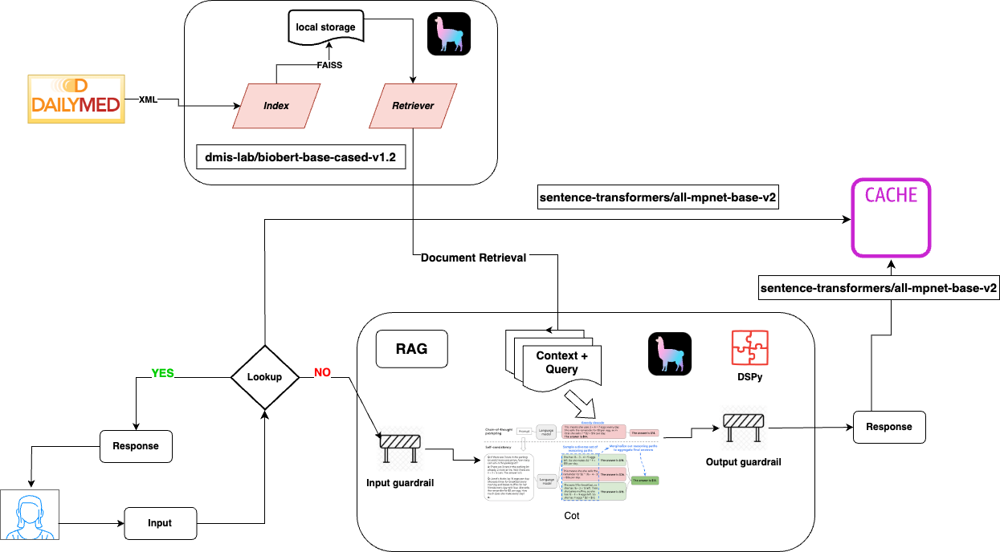

<table>
    <tr>
        <td>
            
        </td>
        <td>
            <h1>MediRAG</h1>
        </td>
    </tr>
</table>

**MediRAG** is a Retrieval-Augmented Generation (RAG) system designed to make drug-related information more accessible
to
patients. Many patients struggle with the patient information leaflets that accompany medications, which are often
packed with crucial information in small print, leading to confusion about dosages, side effects, and other essential
drug details. MedRAG aims to bridge this gap by providing a digital platform where users can easily ask questions and
receive clear, understandable answers.

## Features

- **Bot and Website Development**: A user-friendly interface where patients can input questions and receive responses
  derived from drug guides and patient leaflets.
- **Input and Output Guardrails**: Safeguards to ensure the reliability, appropriateness, and safety of the information
  provided, preventing potential misuse.
- **DSPy Prompting**: Utilizes Dynamic Scripting in Python (DSPy) to create reliable and adaptable prompts for the
  question-answering process.
- **Retrieval-Augmented Generation (RAG) with Semantic Caching**: Enhances data retrieval and response time by caching
  semantically similar queries, ensuring both speed and accuracy.
- **Vector Database**: Leverages a vector database for efficient retrieval of drug information, enabling quick and
  precise responses to user queries.
- **Observability**: Integrated monitoring tools to track system health, retrieval performance, and ensure consistent,
  high-quality user experiences.

## High-Level Architecture



1. **Question-Answering Bot and Website**:
    - Users can interact with a bot on the website to ask drug-related questions.
    - The bot retrieves information from drug guides and patient information leaflets to provide clear and concise
      answers.

2. **Input and Output Guardrails**:
    - Implemented to filter inappropriate or potentially harmful queries.
    - Ensures the bot's responses are accurate and aligned with medical guidelines.

3. **DSPy Prompting**:
    - Uses DSPy to dynamically generate prompts that guide the retrieval process.
    - Helps in crafting responses that are both contextually relevant and easy to understand.

4. **LlamaIndex streaming workflows**:
    - Uses LlamaIndex to construct the streaming workflow.
    - Helps in crafting responses that are both contextually relevant and easy to understand.
    -
5. **Retrieval-Augmented Generation (RAG) with Semantic Caching**:
    - Utilizes a RAG model to combine real-time retrieval with language generation.
    - Semantic caching improves the response time by reusing answers to similar questions.

6. **Vector Database**:
    - Employs a vector database for fast and effective retrieval of information.
    - Enhances the bot's ability to search and retrieve relevant content from large datasets.

7. **Observability**:
    - Includes tools to monitor and log the system’s performance.
    - Helps in maintaining system integrity and ensuring reliable operation.

## Getting Started

To get started with MedRAG:

1. Clone the repository:
   ```bash
   git clone https://github.com/alvinhenrick/medirag.git
   ```
2. Create `.env` and insert your tokens
    ```bash
        HF_TOKEN=Your token
        OPENAI_API_KEY=Your token
    ```
3. Install the required dependencies:
   ```bash
   cd medirag
   poetry install
   ```
4. Run the app:
   ```bash
    poetry run python app.py
   ```

## To-Do List

### High Priority

- [ ] Implement comprehensive observability tools to monitor and log system performance effectively.
- [ ] Explore and implement semantic chunking to enhance retrieval performance and accuracy.

### Medium Priority

- [ ] Experiment with different embeddings and other models to enhance retrieval performance and accuracy.
- [ ] Experiment with different embeddings and other models to improve the accuracy and relevance of bot responses.
- [ ] Index all five DailyMed datasets to ensure complete data coverage and retrieval capabilities.
    - [x] https://dailymed-data.nlm.nih.gov/public-release-files/dm_spl_release_human_rx_part1.zip
    - [ ] https://dailymed-data.nlm.nih.gov/public-release-files/dm_spl_release_human_rx_part2.zip
    - [ ] https://dailymed-data.nlm.nih.gov/public-release-files/dm_spl_release_human_rx_part3.zip
    - [ ] https://dailymed-data.nlm.nih.gov/public-release-files/dm_spl_release_human_rx_part4.zip
    - [ ] https://dailymed-data.nlm.nih.gov/public-release-files/dm_spl_release_human_rx_part5.zip

### Low Priority

- [ ] Add an LLM agent to further enhance the system’s capabilities and improve interaction dynamics.

## License

This project is licensed under the MIT License - see the [LICENSE](LICENSE) file for details.